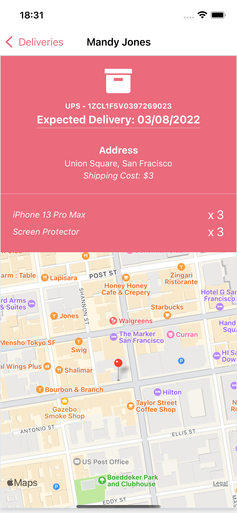

# UPS Delivery Clone App

## 🧪 &nbsp; Techs

This project was developed with these technologies:

- [React Native](https://reactnative.dev/)
- [Typescript](https://www.typescriptlang.org/)
- [GraphQL](https://graphql.org/)
- [Stepzen](https://stepzen.com/)
- [Firebase](https://firebase.google.com/)
- [TailwindCSS](https://tailwindcss.com/)
- [Expo](https://expo.dev/)


## 📖 &nbsp; Project

The idea of the project is from this tutorial [video](https://www.youtube.com/watch?v=hvvWv2GLWss), used only for educational purpouse.

The app fetch data from the API which is hosted by Firebase, and all endpoints and data manipulation is managed by Stepzen and the GraphQL queries. The React Native construct the interface and manage the data to make the user interface and manipulate the data from API.

In this you can see the customers who delivered some product, list them, find where the delivery point with the latitude and logitude.
List all items of some order and from who it is.

## 🚀 &nbsp; How to use


### ✨ &nbsp; Kickstart

Clone the project and go to the root folder.

```bash
$ git clone https://github.com/viniciustneiva/ups-delivery
$ cd ups-delivery
```

Before start your application you need to install all dependencies:

```bash
# Install the dependencies listed in file package.json
$ npm install
```

### 💾 &nbsp; Data

Next, you need to mockup some data in Firebase with a Realtime Database (free) plan.

You can use the data mocked in `mock/ups-delivery.json`, if you want to!

If you choosed Firebase, i recomend you use the Stepzen service, read more in the [documentation](https://stepzen.com/getting-started).

Follow the structure of the API in the `stepzen` and `graphql` folders.

Don't forget to change the `stepzen.config.json` API endpoint!

### ⚙️ &nbsp; Running

If you have configured the Stepzen, you need to start it:

```bash
## In the root of project
$ cd stepzen

$ stepzen start
```

Backing to the root folder:

```bash
# Start the project
$ expo start

# When the expo is ready, press 'i' for iOS or 'a' android
$ i
```

Done!

## 📷 &nbsp; Screenshots

<div style="display:flex;flex-direction: column;">
    <div style="display:flex;justify-content:space-evenly;margin-bottom: 20px;">
        
        
    </div>
    <div style="display:flex;justify-content:space-evenly;">
        
        
    </div>
</div>

